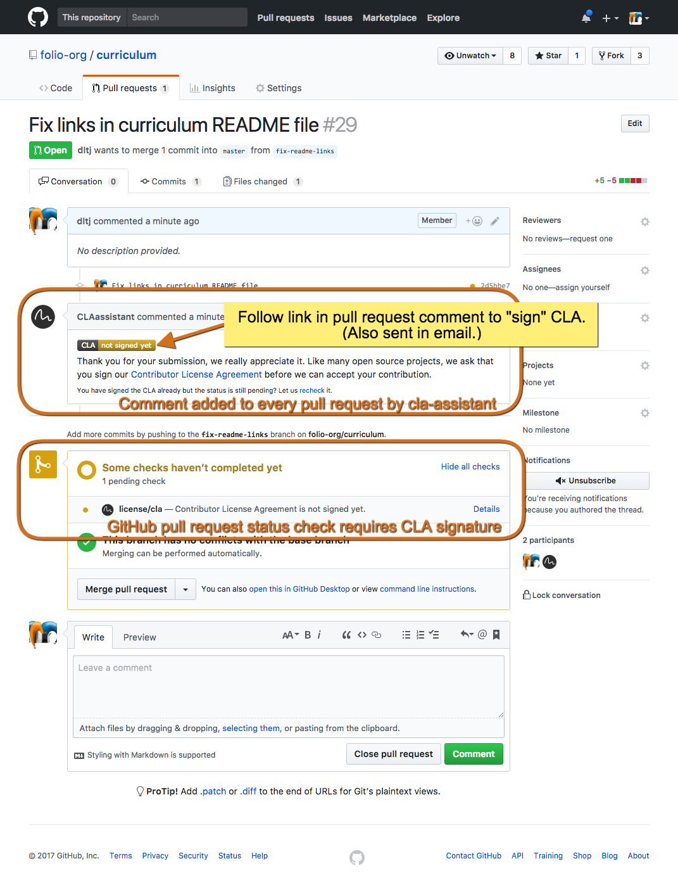
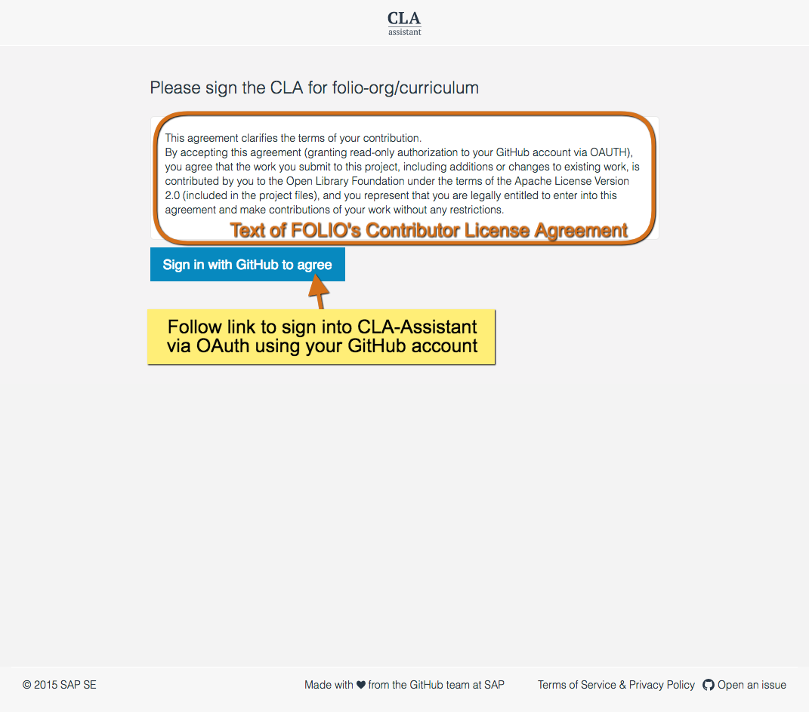
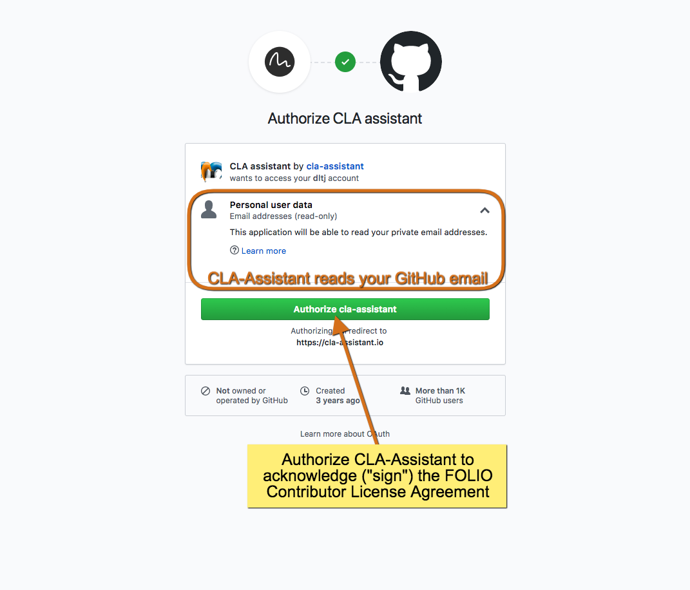
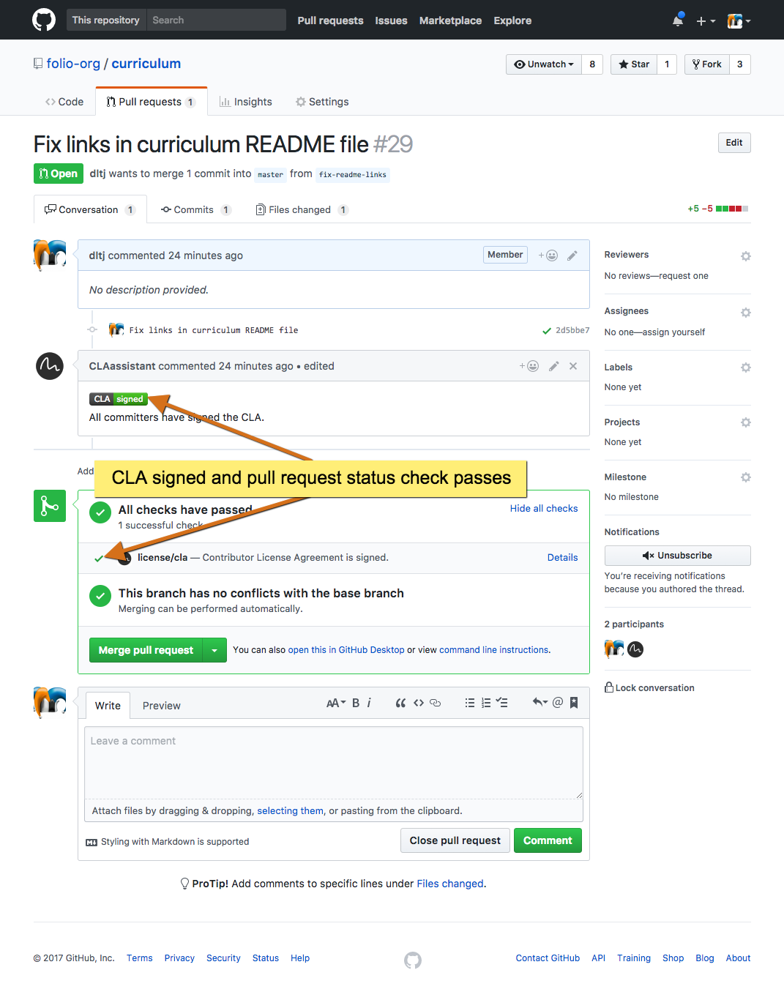

_NOTE: The Contributor License Agreement assistant will be enabled on all FOLIO Project repositories on Thursday, October 19, 2017._

The FOLIO Project uses the [Apache 2.0 license](https://www.apache.org/licenses/LICENSE-2.0) for its code and requires developers to acknowledge their contributions to the project using this license.
The contents of the Contributor License Agreement (CLA) are stored in a Gist on GitHub:



The FOLIO Project uses GitHub pull requests checks to register a contributor's acknowledgement of the license agreement.
Before a pull request can be merged, all contributors to the pull request must acknowledge their agreement with the terms.
This acknowledgement is through each contributor signing into https://cla-assistant.io/ using their GitHub account.
The screen captures below describe the process.
The acknowledgement of the FOLIO CLA covers all pull requests to the [FOLIO Project GitHub Organization](https://github.org/folio-org).
A new acknowledgement will be required if the text of the CLA changes.

## Acknowledging the FOLIO Contributor License Agreement

Git repositories in the folio-org GitHub organization have pull request checks that run automated processes when the pull request is made.
One of these checks verifies that all individual committers to the code in the pull request have acknowledged the FOLIO CLA.
When a pull request is made and one of the contributors has not acknowledged the CLA, the CLA-Assistant will add a message to the pull request.

[{:height="50%" width="50%"}](../images/cla-process/1 - Pull request status check without CLA signature.png){:target="_blank"}

Following the  link leads to the CLA-Assistant page with the text of the Contributor License Agreement Displayed and a link to sign into the CLA-Assistant via GitHub.

[{:height="50%" width="50%"}](../images/cla-process/2 - Display text of CLA and ask to sign in via GitHub.png){:target="_blank"}

GitHub displays a page that asks the contributor to authorize https://cla-assistant.io/ and send that website the contributor's email address.

[{:height="50%" width="50%"}](../images/cla-process/3 - Sign the CLA through GitHub authorization.png){:target="_blank"}

After a few seconds, the contributor is redirected to the GitHub pull request page and the CLA-Assistant pull request check now passes.

[{:height="50%" width="50%"}](../images/cla-process/4 - Pull request status check with CLA signature.png){:target="_blank"}

NOTE: All contributors must acknowledge the CLA before the CLA-Assistant pull request check will pass.
