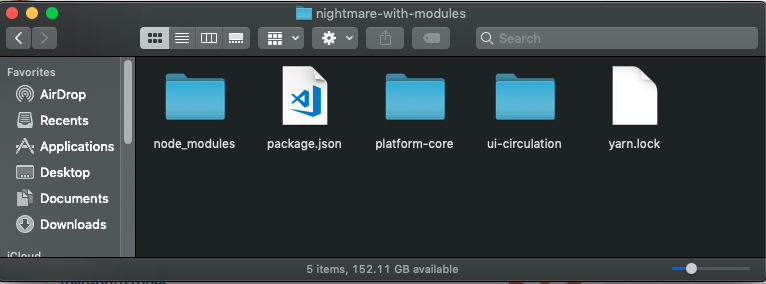
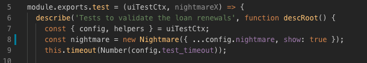

Nightmare is a high-level browser automation library from Segment.

The goal is to expose a few simple methods that mimic user actions (like goto, type and click), with an API that feels synchronous for each block of scripting, rather than deeply nested callbacks. It was originally designed for automating tasks across sites that don't have APIs, but is most often used for UI testing and crawling.

Under the covers it uses Electron, which is similar to PhantomJS but roughly twice as fast and more modern.

## Run an existing scenario

All scenarios are stored in the platform-core module and easiest way to run tests is to clone this repository, install dependencies and run tests.

##### The important thing - to run tests it is needed to checkout on the _snapshot_ branch, as far as I understood only this branch is currently up to date.
```code
git clone git@github.com:folio-org/platform-core.git
cd platform-core
git checkout snapshot
yarn
yarn test-int --run WD:loan_renewal
```

## Test local changes

I want to demonstrate you flow of running test for new branch:

1. Let's create a new directory and go there.

1. create a **package.json** file with such content:
```code
{
   "private": true,
   "workspaces": [
     "*"
   ],
   "devDependencies": {
     "@folio/stripes-cli": "^1.2.0"
   },
   "dependencies": {}
}
```

1. clone platform core (and checkout **snapshot** branch)

1. clone module (or modules) where we have added changes (and checkout branch with new feature)

1. After that, we should install dependencies for our modules. So we should run yarn in the folder where we have modules and **package.json** file.
So you should install dependencies in a folder similar to what we have in the screenshot (In this case I have made changes in the **ui-circulation** module, so I have cloned this module) :

1. After that we can go to the platform-core directory and run tests:
```code
yarn test-int
```

## Some hints

1. In tests, you should use **CSS** selectors instead of **[data-test...]** attributes, cause these attributes will be stripped from the production build and therefore are unavailable when the integration tests run against folio-testing or folio-snapshot.
1. Always check the current state of the back-end, cause some dependencies may cause unexpected behavior. (the possible way is to destroy and restart vagrant before running tests)
1. You can check out what is going on by:
* providing the **--show** option:
 ```code
yarn test-int --show
```
* adding **show: true** property in nightmare config or particular scenario (as it shown in the screenshot):



## Useful links
* https://github.com/folio-org/platform-core
* https://github.com/segmentio/nightmare


